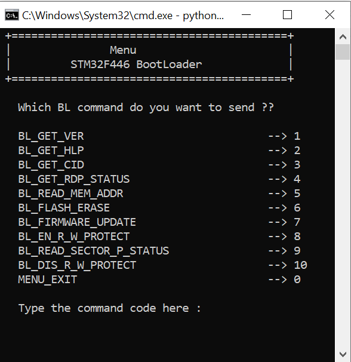
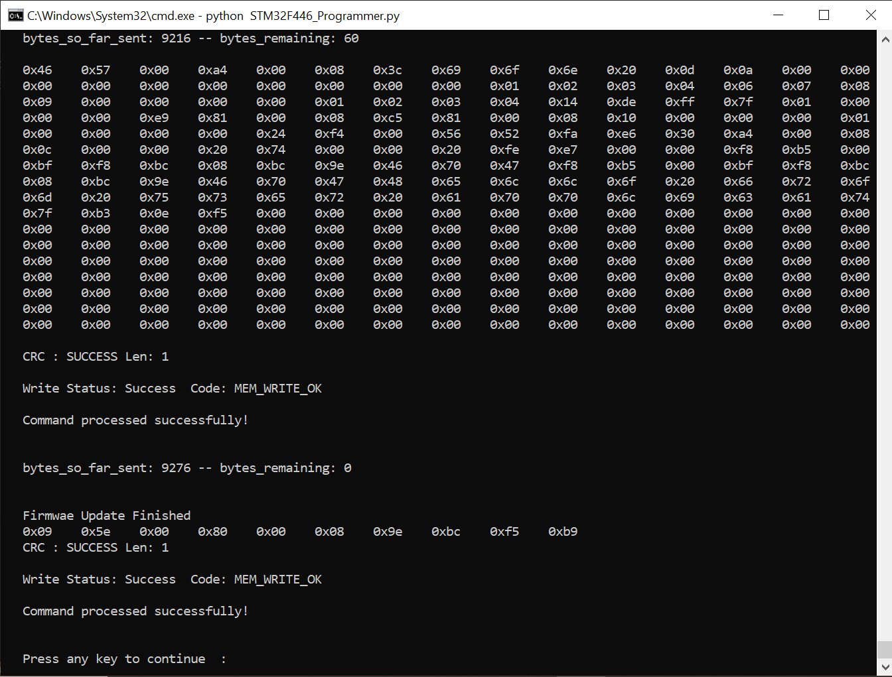

# Project Title: STM32 Bootloader and Firmware Programming Utility

## Overview
This project presents a sophisticated yet user-friendly solution for firmware management on STM32 microcontrollers. It combines a custom bootloader, written in C, with a Python-based programming utility that simplifies the process of updating, verifying, and managing firmware. Whether you're a seasoned developer or new to embedded systems, this project offers a reliable framework for ensuring your STM32-based devices run the latest and most stable firmware.

## Project Components

### Bootloader (C Source Files)
- **bootloader.c**: The core of the bootloader's functionality, responsible for handling the transition from bootloader to application code. It includes essential operations such as checking for valid firmware, managing firmware updates, and handling system errors.
- **bootloader.h**: This header file defines critical constants, data types, and external variables used by the bootloader. It serves as the interface between the bootloader logic and other parts of the system.
- **main.c**: The main application code, structured to integrate seamlessly with the bootloader. It includes the essential system initialization routines and provides a starting point for your application code.

### Python Firmware Programming Utility
- **STM32_Programmer.py**: A powerful yet easy-to-use Python script designed to communicate with the STM32 bootloader via a serial interface. It supports a wide range of commands, including erasing flash memory, writing new firmware, and verifying the integrity of the firmware, all through a simple command-line interface.

## Key Features and Benefits

### Bootloader Highlights:
- **Seamless Application Jump**: The bootloader ensures a smooth and reliable transition from the bootloader phase to the main application, only proceeding when the firmware is verified and stable.
- **Flexible Firmware Storage Options**: The bootloader is not limited to updating firmware in the internal flash memory of the STM32. It also supports firmware updates in SRAM and external flash or SRAM, providing flexibility in how and where the firmware is stored and executed. This is particularly useful for applications requiring high-speed execution from SRAM or expanded storage capacity from external memory.
- **Robust Firmware Management**: Equipped with functions to safely erase, write, and verify firmware, the bootloader provides a secure environment for firmware updates regardless of the memory type being used.
- **Security Features**: The bootloader includes commands to enable and disable read/write protection on specific memory sectors. This is crucial for safeguarding sensitive data and preventing unauthorized modifications.
- **Memory Inspection and Control**: With commands that allow direct reading of memory contents and checking the protection status of memory sectors, the bootloader offers powerful tools for developers to inspect and control the microcontroller's memory.

### Programming Utility Features:
- **Cross-Platform Functionality**: Written in Python, the programming utility is compatible with multiple operating systems, including Windows, macOS, and Linux, providing flexibility in deployment.
- **Intuitive Serial Communication**: The utility leverages the PySerial library for robust and reliable communication with the STM32 microcontroller, enabling effective firmware management over a serial interface.
- **Versatile Command Set**: From flashing new firmware to verifying the existing one, the utility provides a comprehensive command set that simplifies complex tasks, making firmware updates straightforward and accessible to all levels of users.

## How It Works

### Bootloader Initialization
Upon powering up, the STM32 microcontroller starts executing the bootloader, which checks for the presence of valid application firmware. If the firmware is valid, the bootloader prepares to jump to the application.

### Firmware Update Process
The Python utility initiates communication with the bootloader over a serial connection. The utility handles the transfer of firmware in blocks, which the bootloader writes to the microcontroller’s flash memory, SRAM, or external memory, ensuring that each block is correctly written and verified.

### Safe Transition to Application
Once the firmware update is complete and verified, the bootloader jumps to the application’s starting address, seamlessly handing over control to the main application code.

## Installation and Usage

### Setting Up the Python Utility:
1. Install the necessary Python dependencies:
   ```bash
   pip install pyserial
   ```

2. Use the utility in scripts folder to program your STM32 device:
   ```bash
   python STM32F446_Programmer
   ```

### Integrating the Bootloader:
1. Build the bootloader and application using Visual Studio Code development environment.
2. Flash the compiled bootloader to the STM32 microcontroller.
3. Utilize the Python utility to flash the main application firmware to the desired memory location—internal flash, SRAM, or external memory—and perform updates as needed.

## Conclusion
This project provides a reliable and user-friendly framework for managing firmware on STM32 microcontrollers. By integrating a straightforward bootloader with a versatile Python programming utility, it ensures that your STM32 devices can be efficiently updated and maintained.

## Screenshots

### Bootloader Command Menu:


### Firmware Update Process:



